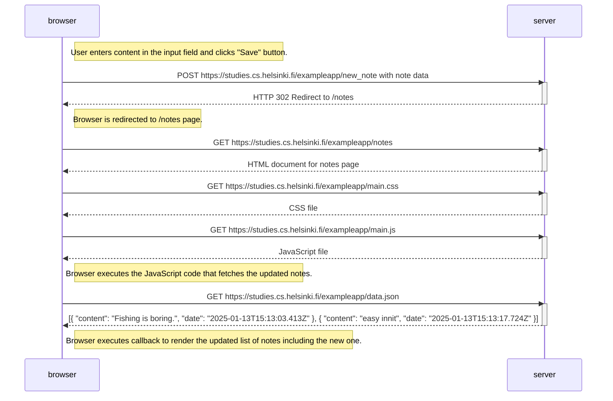

```mermaid
sequenceDiagram
    participant browser
    participant server

    Note right of browser: User enters content in the input field and clicks "Save" button.
    
    browser->>server: POST https://studies.cs.helsinki.fi/exampleapp/new_note with note data
    activate server
    server-->>browser: HTTP 302 Redirect to /notes
    deactivate server

    Note right of browser: Browser is redirected to /notes page.
    
    browser->>server: GET https://studies.cs.helsinki.fi/exampleapp/notes
    activate server
    server-->>browser: HTML document for notes page
    deactivate server

    browser->>server: GET https://studies.cs.helsinki.fi/exampleapp/main.css
    activate server
    server-->>browser: CSS file
    deactivate server

    browser->>server: GET https://studies.cs.helsinki.fi/exampleapp/main.js
    activate server
    server-->>browser: JavaScript file
    deactivate server

    Note right of browser: Browser executes the JavaScript code that fetches the updated notes.

    browser->>server: GET https://studies.cs.helsinki.fi/exampleapp/data.json
    activate server
    server-->>browser: [{ "content": "Fishing is boring.", "date": "2025-01-13T15:13:03.413Z" }, { "content": "easy innit", "date": "2025-01-13T15:13:17.724Z" }]
    deactivate server

    Note right of browser: Browser executes callback to render the updated list of notes including the new one.
```
