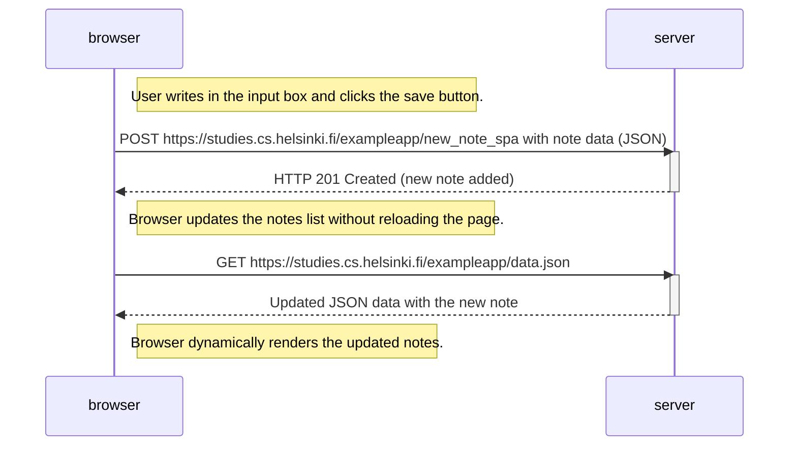

```mermaid

   sequenceDiagram
    participant browser
    participant server

    Note right of browser: User writes in the input box and clicks the save button.

    browser->>server: POST https://studies.cs.helsinki.fi/exampleapp/new_note_spa with note data (JSON)
    activate server
    server-->>browser: HTTP 201 Created (new note added)
    deactivate server

    Note right of browser: Browser updates the notes list without reloading the page.

    browser->>server: GET https://studies.cs.helsinki.fi/exampleapp/data.json
    activate server
    server-->>browser: Updated JSON data with the new note
    deactivate server

    Note right of browser: Browser dynamically renders the updated notes.

```
